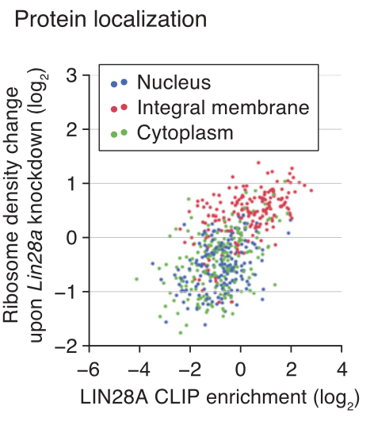
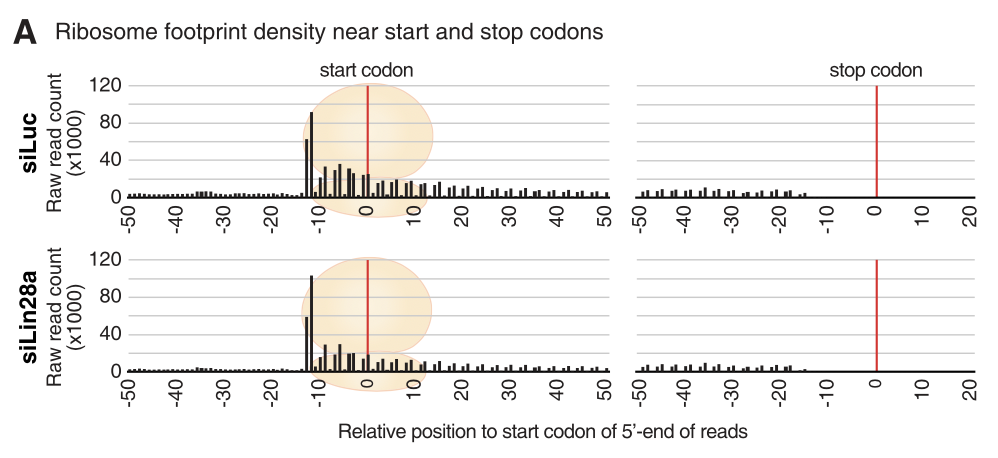
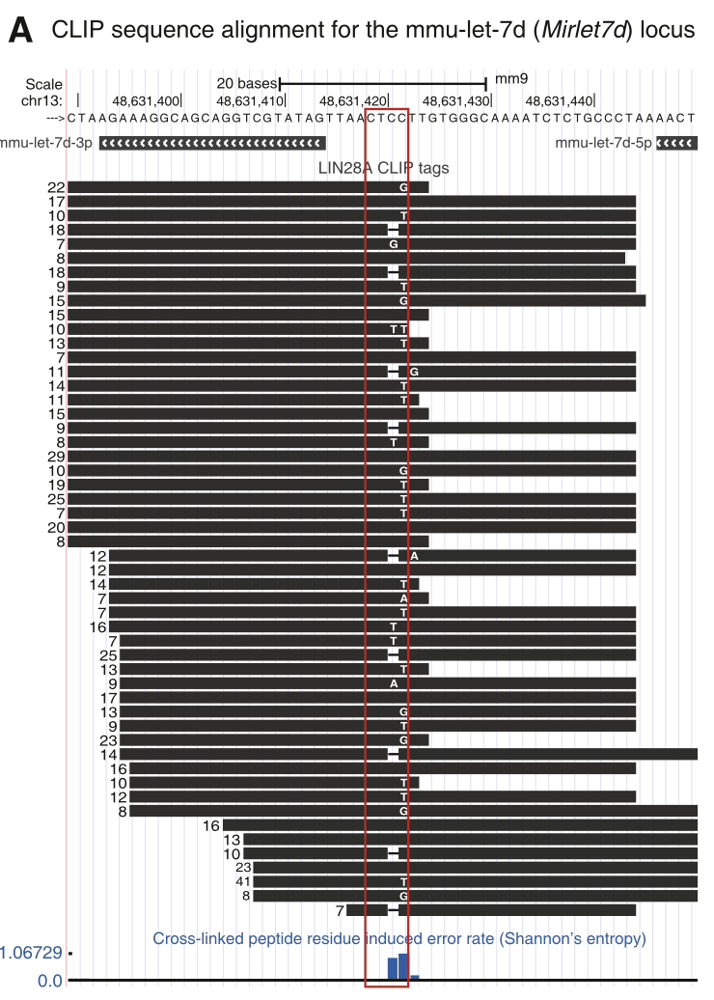

# termProject
bioinformatics_practice1 (2021 Spring, SNU) TermProject01  

## Mission01 ~ Mission03

From **Cho, Jun, et al. "LIN28A is a suppressor of ER-associated translation in embryonic stem cells." *Cell* 151.4 (2012): 765-777**.

  

### Mission01

making figure5B in the article

1. 제공된 CoLab 노트북을 진행하여 transcrpit count table 을 획득
   * `mission1/CoLab_TermProj_provided.ipynb`
2. R에 1을 import하여 figure를 생산함
   * `mission1/mission01.Rmd`
   * .Rmd 파일이 깃헙에서 열람이 안되므로 `mission1/outputs/mission01.html` 와`mission1/outputs/mission01.md` 또한 upload

### Mission2

making supplementary figure S5A

1. 제공된 CoLab노트북을 진행하여 start codon지역의 5'-end의 coverage count를 획득
2. 1의 결과를 start codon 대비 relative position 별 read count 그래프를 획득

* 1과 2 프로세스과정 모두 `mission2/mission02.ipynb`

  

### Mission3

making supplementary figure S2A

1. 제공된 CoLab노트북 과정대로 Mirlet7d, Mirlet__, Mirlet7f-1유전자의 pileup 데이터 획득
2. shannon entropy 계산 및 USCS Genome Browser에서의 figure 획득

* 1과 2프로세스 과정 모두 `mission3/mission03.ipynb`

  

  

  

# My Own Project

From **Guo, Yue, et al. "DNA methylome and transcriptome alterations and cancer prevention by curcumin in colitis-accelerated colon cancer in mice." *Carcinogenesis* 39.5 (2018): 669-680.**

 

1. SRA data download (shell script)

2. Alignment (STAR w/ mm39)

3. Feature Count data

4. DEG analysis and visualization (DESeq2)

   